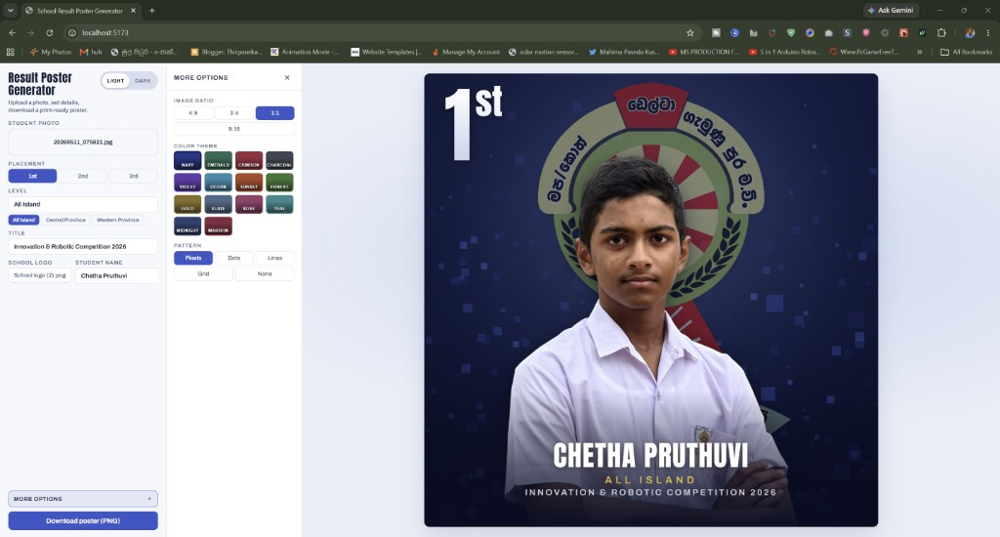
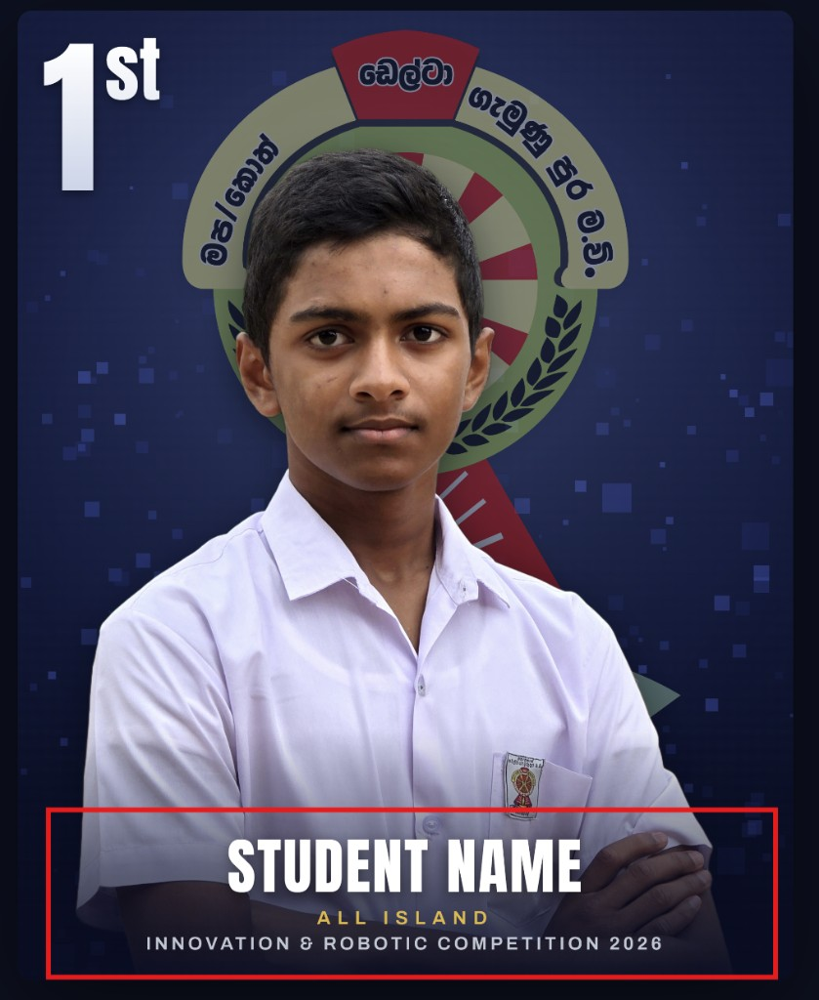

# School Result Poster Generator

A client-side web app that turns a student photo, a placement (1st / 2nd / 3rd), a school logo, and a name into a high-resolution result poster with a fixed F1-style design: a giant school logo behind a cutout of the student on a dark navy textured background, with the placement (1ˢᵗ / 2ⁿᵈ / 3ʳᵈ) in the top-left corner and the name in a footer strip.

Everything runs in the browser — the photo background is removed locally with [`@imgly/background-removal`](https://github.com/imgly/background-removal-js) (WASM), and the poster is composed on a 2048x2560 canvas and exported as PNG. No server, no uploads.

## Setup

```bash
npm install
npm run dev
```

Open the printed URL (default http://localhost:5173).

## Usage

1. Drag in (or browse for) the student photo. Background removal and color adjustment start automatically; the first run downloads the segmentation model (~40 MB), so it takes a little longer.
2. Pick the placement (1st, 2nd, or 3rd place).
3. Open **More options** to choose image ratio (`4:5`, `3:4`, `1:1`, or `9:16`), color theme (Navy, Emerald, Crimson, Charcoal, Violet, Ocean, Sunset, Forest, Gold, Slate, Rose, Teal, Midnight, Maroon), and background pattern (Pixels, Dots, Lines, Grid, or None).
4. Enter the **Level** (e.g. "All Island", "Central Province") and **Title** (e.g. "Innovation & Robotic Competition", "Music Competition").
5. Upload the school logo (transparent PNG recommended) — shown large behind the student.
6. Type the student name.
7. Click **Download poster (PNG)** — the exported file is named `poster-<name>-P<n>-<ratio>.png`.

## Build

```bash
npm run build
npm run preview
```

## Install as an app (PWA)

After `npm run build && npm run preview` (or deploying over HTTPS):

1. Open the app in Chrome / Edge.
2. Click **Install app** in the sidebar (or use the browser install icon in the address bar).
3. Launch **Poster Gen** from your desktop / Start menu / home screen — it opens fullscreen like a native app.

On iPhone/iPad: Safari → Share → **Add to Home Screen**.

The service worker caches the app shell and fonts for faster launches. The background-removal model still downloads on first photo processing (~40 MB).

## Screenshots

Desktop UI (More options):



Mobile / tablet UI (responsive overlay; no page scrolling):



Bold demo for Level + Competition title:


## Tech

- Vite + React + TypeScript
- Progressive Web App (`vite-plugin-pwa`) — installable, standalone display
- Canvas 2D compositing (`src/lib/renderPoster.ts`)
- Browser background removal (`src/lib/removeBackground.ts`)
- Self-hosted fonts: Anton (placement numeral) and Archivo (name strip) in `public/fonts/`
